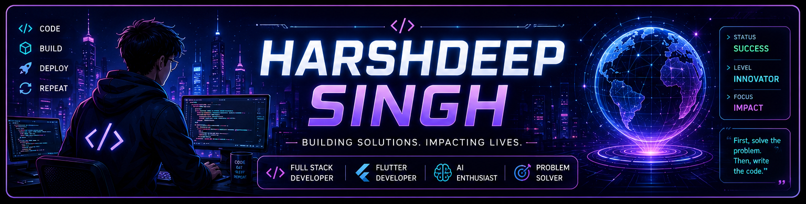
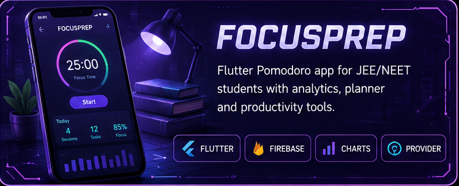
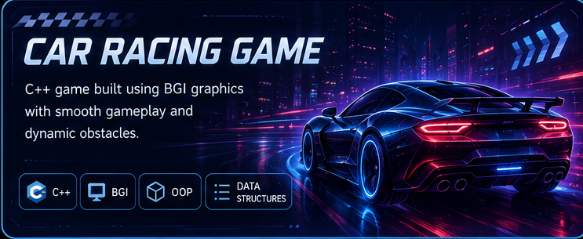

<div align="center">



# 👋 Hi, I'm Harshdeep Singh

### 🚀 Full Stack MERN Developer • Flutter Developer • AI Enthusiast


<p>

<a href="https://linkedin.com/in/harshdeepsingh270506">

</a>

<a href="mailto:harshdeepsingh6602@gmail.com">

</a>

<a href="https://harshdeep1212.netlify.app">

</a>

<a href="https://github.com/harsh22255">

</a>

</p>

</div>

---

# 🚀 About Me

```cpp
Name        : Harshdeep Singh

College     : JIIT Noida

Degree      : B.Tech Computer Science

Year        : Third Year

Current Focus:
• MERN Stack
• Flutter
• Artificial Intelligence

Learning:
• Next.js
• DevOps
• System Design
• Advanced DSA

Achievements:
✓ 300+ LeetCode Problems
✓ GDG Core Tech Team
✓ Hackathon Participant
✓ Open Source Contributor

Email:
harshdeepsingh6602@gmail.com
```

---

# 💻 Tech Stack

<p align="center">


</p>

---

# 📊 GitHub Analytics

<p align="center">


</p>

<p align="center">


</p>

---

# 📈 Contribution Graph

<p align="center">


</p>

---

# 🐍 Contribution Snake

<picture>

<source media="(prefers-color-scheme: dark)"
srcset="https://raw.githubusercontent.com/harsh22255/harsh22255/output/github-contribution-grid-snake-dark.svg">

<source media="(prefers-color-scheme: light)"
srcset="https://raw.githubusercontent.com/harsh22255/harsh22255/output/github-contribution-grid-snake.svg">


</picture>

---

# 🚀 Featured Projects

<table>

<tr>

<td width="50%">


### 🌍 LocalConnect

Hyperlocal Skill Exchange Platform

**Tech**

MERN • JWT • Maps API • Firebase

</td>

<td width="50%">


### ❤️ HealTrack

AI-powered Healthcare Companion

**Tech**

Flutter • AI • Firebase

</td>

</tr>

<tr>

<td>



### 📚 FocusPrep

Pomodoro Productivity App

**Tech**

Flutter • Firebase • Charts

</td>

<td>



### 🏎️ Car Racing Game

C++ Graphics Project

**Tech**

C++ • BGI Graphics

</td>

</tr>

</table>

---

# 🏆 Achievements

🥇 300+ LeetCode Problems

🥈 Google Developer Groups Core Tech Team

🥉 Full Stack MERN Developer

🏅 Flutter Developer

🏅 AI Project Builder

---

# 💡 Quote

> **"Consistency beats intensity. Build something every single day."**

---

<p align="center">


</p>

---

<div align="center">

## ⭐ Thanks for visiting my profile!

### Happy Coding 🚀

</div>
